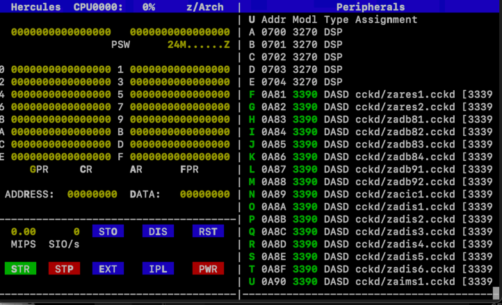
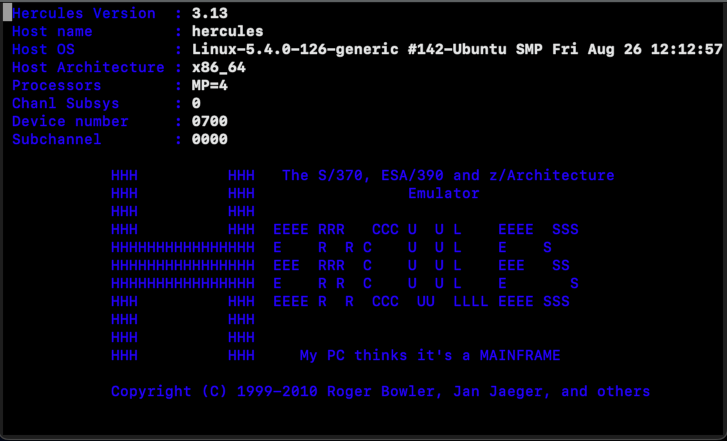
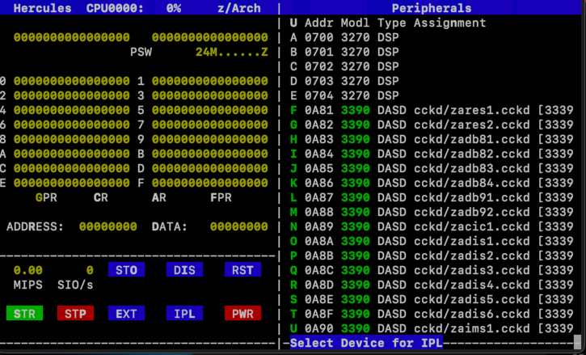
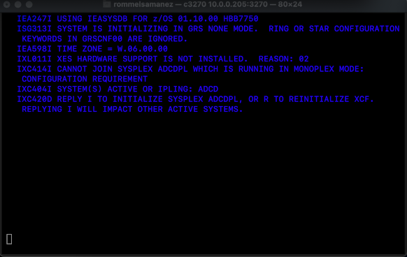
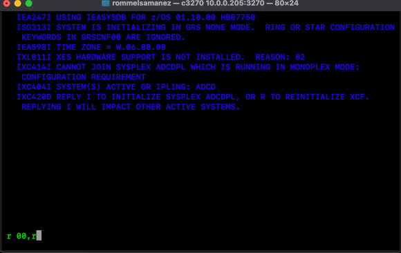
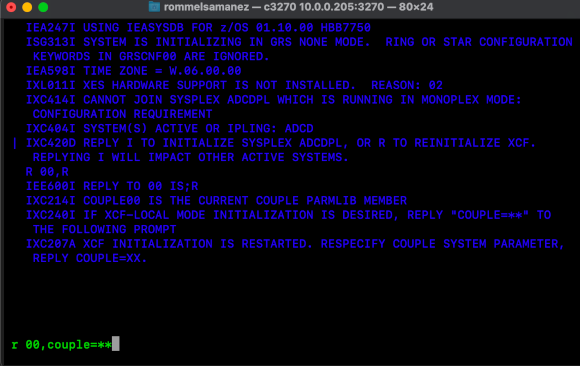
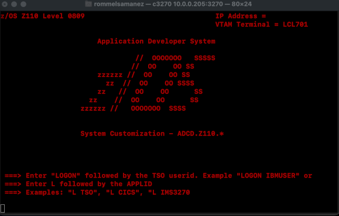
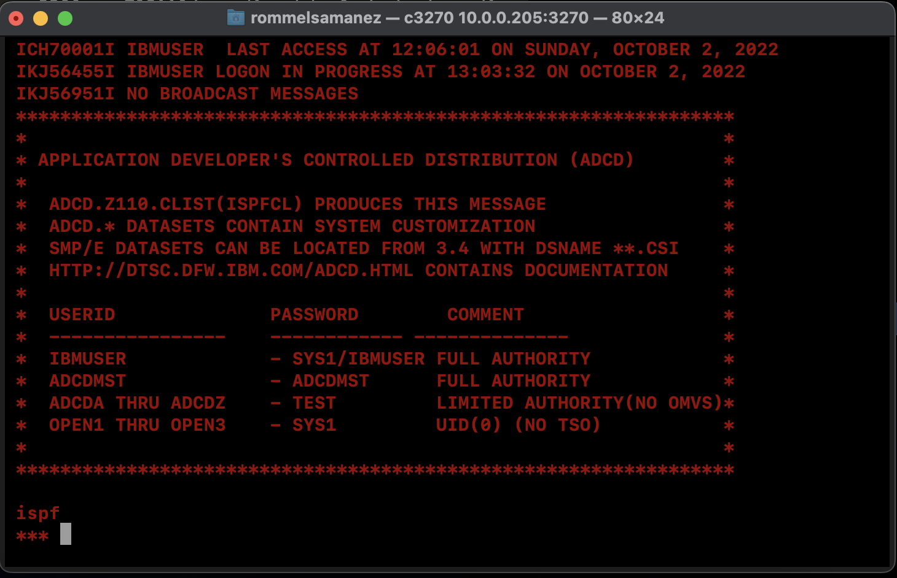

# Setup Hercules Emulator with IBM z/os in Linux environment
I am using a linux Ubuntu 20.04.3
```
sudo apt-get update
sudo apt-get install hercules
sudo apt-get install c3270
```
Test your c3270 emulator
```
c3270
```
to exit from the emulator write: quit
### Prepare to configure hercules emulator with z/os
```
cd ~
mkdir MAINFRAME
mkdir MAINFRAME/cckd
cd MAINFRAME
nano runHercules.sh
```
runHercules.sh
```
hercules -f  hercules.cnf
```
create the hercules.cnf
```
#
# Hercules Emulator Control file...
# Description: 
# MaxShutdownSecs: 15
#
#
# System parameters
#

ARCHMODE  z/Arch
ALRF      ENABLE
CCKD      RA=2,RAQ=4,RAT=2,WR=2,GCINT=5,GCPARM=0,NOSTRESS=0,TRACE=0,FREEPEND=-1
CNSLPORT  3270
CONKPALV  (3,1,10)
CPUMODEL  3090
CPUSERIAL 012345
DIAG8CMD  ENABLE
ECPSVM    YES
LOADPARM  0A95DB..
LPARNAME  HERCULES
MAINSIZE  1024
MOUNTED_TAPE_REINIT  DISALLOW
NUMCPU    4
OSTAILOR  Z/OS
PANRATE   80
PGMPRDOS  LICENSED
SHCMDOPT  NODIAG8
SYSEPOCH  1900
TIMERINT  50
TZOFFSET  +1400
YROFFSET  0

HERCPRIO  0
TODPRIO   -20
DEVPRIO   8
CPUPRIO   0
PANTITLE  z/OS 1.9 IPL A80?

# Display Terminals

0700    3270
0701    3270
0702    3270
0703    3270
0704    3270

# DASD Devices

0A81    3390    cckd/zares1.cckd sf=shadow/zares1_*
0A82    3390    cckd/zares2.cckd sf=shadow/zares2_*
0A83    3390    cckd/zadb81.cckd sf=shadow/zadb81_*
0A84    3390    cckd/zadb82.cckd sf=shadow/zadb82_*
0A85    3390    cckd/zadb83.cckd sf=shadow/zadb83_*
0A86    3390    cckd/zadb84.cckd sf=shadow/zadb84_*
0A87    3390    cckd/zadb91.cckd sf=shadow/zadb91_*
0A88    3390    cckd/zadb92.cckd sf=shadow/zadb92_*
0A89    3390    cckd/zacic1.cckd sf=shadow/zacic1_*
0A8A    3390    cckd/zadis1.cckd sf=shadow/zadis1_*
0A8B    3390    cckd/zadis2.cckd sf=shadow/zadis2_*
0A8C    3390    cckd/zadis3.cckd sf=shadow/zadis3_*
0A8D    3390    cckd/zadis4.cckd sf=shadow/zadis4_*
0A8E    3390    cckd/zadis5.cckd sf=shadow/zadis5_*
0A8F    3390    cckd/zadis6.cckd sf=shadow/zadis6_*
0A90    3390    cckd/zaims1.cckd sf=shadow/zaims1_*
0A91    3390    cckd/zaprd1.cckd sf=shadow/zaprd1_*
0A92    3390    cckd/zaprd2.cckd sf=shadow/zaprd2_*
0A93    3390    cckd/zaprd3.cckd sf=shadow/zaprd3_*
0A94    3390    cckd/zaprd4.cckd sf=shadow/zaprd4_*
0A95    3390    cckd/zasys1.cckd sf=shadow/zasys1_*
0A96    3390    cckd/zauss1.cckd sf=shadow/zauss1_*
0A97    3390    cckd/zawas1.cckd sf=shadow/zawas1_*
0A98    3390    cckd/zawas2.cckd sf=shadow/zawas2_*
0A99    3390    cckd/zawas3.cckd sf=shadow/zawas3_*
0A9A    3390    cckd/sares1.cckd sf=shadow/sares1_*
```
Download the z/os 1.1 from torrents
```
magnet:?xt=urn:btih:MD3UK2UG7RX66BJXX3RMESC2TBPEBVMV&dn=IBM+ADCD+Z%2FOS+1.10&tr=udp://tracker.publicbt.com:80/announce
```
#### Start the hercules emulator
```
chmod a+x runHercules.sh
sudo ./runHercules.sh
```
And then press ESC key 

   
Now open two c3270 consoles
```
c3270 [your-linux-ip]:3270
```



Now Press: L and then F    

   
Wait until z/os starts, you will see the results in the first c3270 console like this.   

     
In the console1, response to the cuestion:
```
r 00,r
```

response to the second question:
```
r 00,couple=**
```

It will start the z/os operating system and then you will see the results in the second c3270 console like this:      

In the second console, login to the z/os
```
logon ibmuser
```
and then enter the password: sys1    
Finally you will see a console like this:



